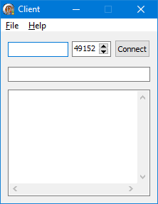
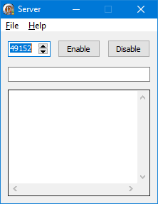
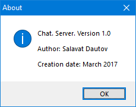

# Chat
A simple client-server chat written in Delphi.

## Screens

Some screenshots of the app

Client main window:  
  
Client about window:  
  
Server main window:  
  
Server about window:  

